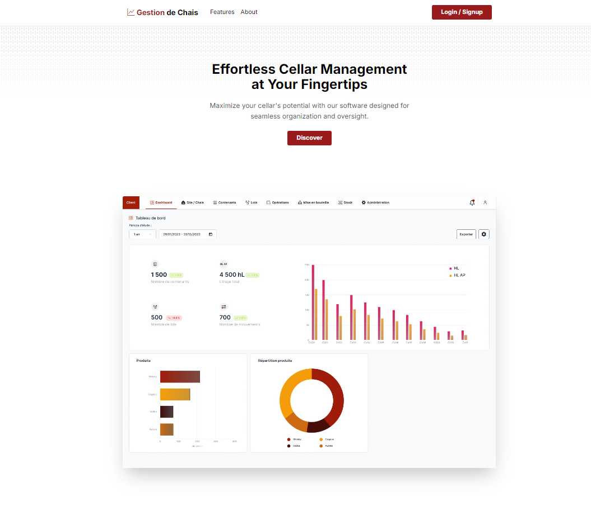
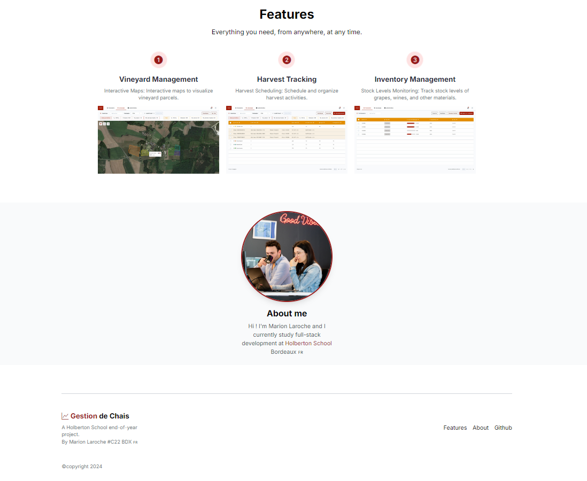

<picture>
 <source media="(prefers-color-scheme: dark)" srcset="https://images.squarespace-cdn.com/content/v1/5a4bfe8bf09ca4228ceca3b7/1539139199598-ANH454IHZI1OKWONKRXY/logo.jpg?format=2500w">
 <source media="(prefers-color-scheme: light)" srcset="https://encrypted-tbn0.gstatic.com/images?q=tbn:ANd9GcQIrK23KvJPB7XdZrIk9mHwe3GZvtsUZLjkh-eG6KRgCLeWu3MW0kFcggq4COpLmeZviQ&usqp=CAU">
 
</picture>

<B><h1 align="center">
# **Landing Page Project**
</h1></B>

An elegant and responsive landing page for **Gestion de Chais**, showcasing effortless cellar management at your fingertips.

## **What is a Landing Page?**

A **landing page** is a standalone web page created specifically for marketing or advertising campaigns. It's where a visitor "lands" after clicking on a link in an email, advertisement, or other digital source. Landing pages are designed with a single focused objective — known as a **Call to Action (CTA)** — to increase conversion rates for marketing campaigns.

## **Project Overview**

This project is a landing page for **Gestion de Chais**, a software solution designed to maximize your cellar's potential with seamless organization and oversight.

### **Features Highlighted**

- **Vineyard Management**: Interactive maps to visualize vineyard parcels.
- **Harvest Tracking**: Schedule and organize harvest activities efficiently.
- **Inventory Management**: Monitor stock levels of grapes, wines, and other materials.

here's a preview of my landing page !

## **About Me**

Hi! I'm **Marion Laroche**, a full-stack development student at [Holberton School Bordeaux](https://www.holbertonschool.fr/campus/bordeaux) 🇫🇷.

Passionate about web development and crafting user-friendly applications, I created this landing page to showcase both the features of **Gestion de Chais** and my skills in front-end development.

## **How to Access the Landing Page**

You can view the live landing page by visiting:

👉 **[https://mamuche.github.io/](https://mamuche.github.io/)**

### **Viewing on Google**

1. Open your preferred web browser.
2. Go to [Google](https://www.google.com).
3. Type **"mamuche github pages"** into the search bar.
4. Click on the link titled **"Mamuche · GitHub"** or directly on **"https://mamuche.github.io/"**.
5. You will be directed to the landing page for **Gestion de Chais**.

## **Authors**

Laroche Marion [Github](https://github.com/Mamuche), [LinkedIn](https://www.linkedin.com/in/marion-laroche-8b235a284/).